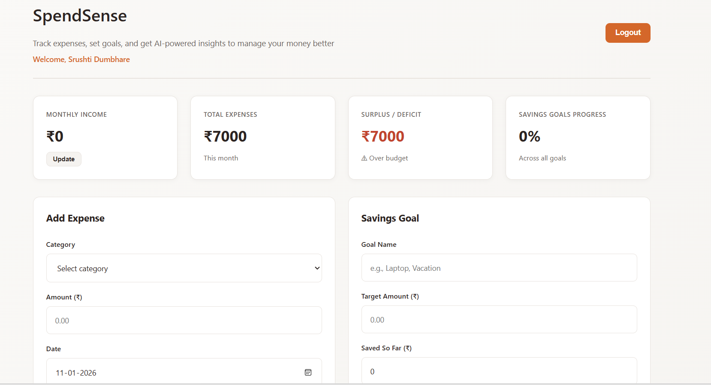
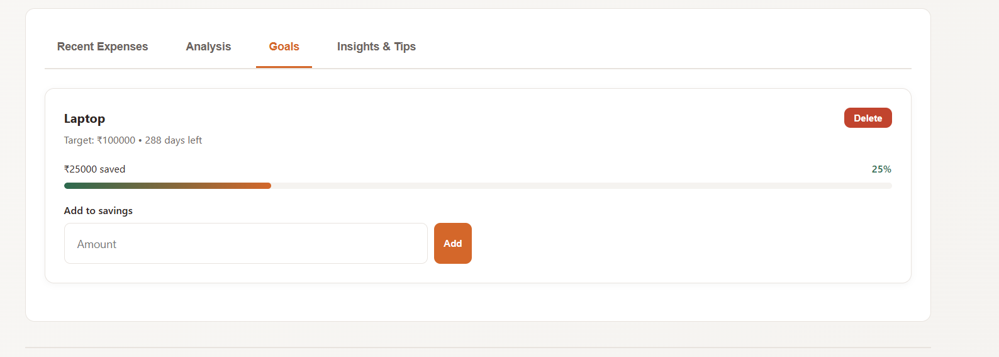

# SpendSense — Personal Finance Expense Tracker

SpendSense is a modern web-based personal finance tool that enables users to track expenses, set savings goals, analyze spending patterns, and receive AI-inspired financial insights. The app also supports exporting monthly financial reports and user-specific data.

---

## 🚀 Live Demo (GitHub Pages)

🔗 https://srushtidumbhare7-ad.github.io/spendsense-expense-tracker/
---

## 🌟 Key Features

- **User Authentication** — Login/Signup with per-user local session
- **Expense Tracking** — Add, edit, delete expenses with categories & recurrence option
- **Savings Goals** — Set financial goals with visual progress tracking
- **Analytics Dashboard** — Category, essential vs non-essential, and monthly trend charts (Chart.js)
- **AI-Based Insights** — Forecast next month spending + confidence level + savings tips
- **PDF Report Export** — Monthly financial summary via html2pdf.js
- **JSON Export** — Export raw data for further analysis
- **Responsive UI** — Clean and mobile-friendly interface
- **Data Persistence** — Per-user state saved using localStorage (no backend required)

---

## 🧩 Tech Stack

**Frontend**
- HTML5
- CSS3
- JavaScript (ES6+)

**Libraries**
- Chart.js (charts & analytics)
- html2pdf.js (PDF export)

**Storage**
- LocalStorage (multi-user session)

---

## 📸 Screenshots & UI Preview

### Login

### Dashboard

### Analytics / Spending Insights

### AI Insights & Forecast

### Goals & Savings Progress

### Signup

### PDF Report Export

